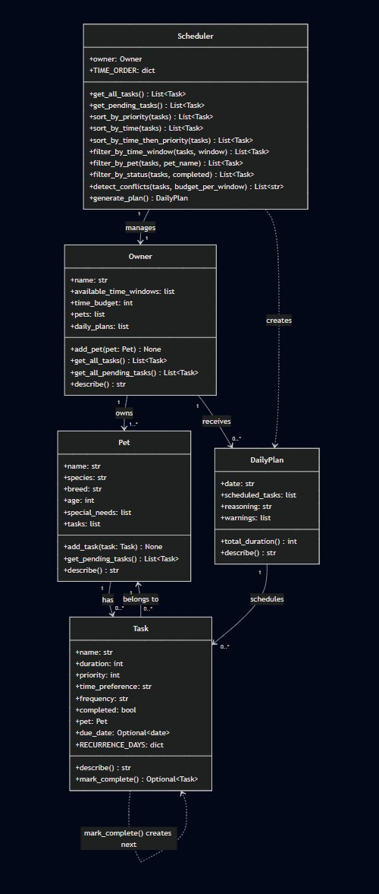

# PawPal+ (Module 2 Project)

**PawPal+** is a smart pet care management system built with Python and Streamlit. It helps pet owners plan daily care routines -- feedings, walks, medications, and appointments -- using algorithmic logic to organize and prioritize tasks.

## Features

- **Multi-pet management**: Register multiple pets under one owner, each with their own task lists and special needs
- **Task scheduling**: Add tasks with duration, priority (low/medium/high), time window preference (morning/afternoon/evening), and frequency (daily/weekly/once)
- **Priority-based greedy scheduling**: The Scheduler selects the most important tasks first, packing them into the owner's daily time budget. Shorter tasks break ties so more activities fit.
- **Sorting by time**: Tasks are ordered chronologically (morning -> afternoon -> evening) with priority as a tiebreaker within each window
- **Filtering**: View tasks by pet name, completion status (pending/completed), or time window
- **Daily recurrence**: Completing a daily task auto-creates the next occurrence due tomorrow; weekly tasks recur in 7 days using `timedelta`
- **Conflict warnings**: The scheduler detects and warns when a time window is overbooked or when one pet has multiple tasks competing for the same window
- **Plan reasoning**: Every generated plan includes an explanation of why tasks were chosen and how they were ordered
- **Mark tasks complete**: Complete tasks directly from the UI, with automatic recurring task creation

## Demo

<a href="/course_images/ai110/app_running_screenshot.jpg" target="_blank"></a>

## System Architecture



## Testing PawPal+

Run the full test suite from the project root:

```bash
python -m pytest
```

The suite includes **13 tests** covering:

- **Basic operations**: Task completion status toggle, pet task list growth
- **Sorting correctness**: Tasks returned in chronological order (morning -> afternoon -> evening); higher priority ranks first within the same window
- **Recurrence logic**: Daily tasks create a next-day occurrence, weekly tasks create a +7 day occurrence, one-off tasks do not recur
- **Conflict detection**: Overbooked time windows are flagged, same-pet overlaps in one window are warned, and balanced schedules produce no false positives
- **Budget enforcement**: Plan duration never exceeds the owner's time budget; high-priority tasks are chosen over low-priority when budget is tight
- **Edge cases**: A pet with zero tasks generates an empty plan without crashing

**Confidence Level: 4/5**

The core scheduling logic, sorting, recurrence, and conflict detection are all verified. One star is held back because the test suite does not yet cover multi-owner scenarios, the Streamlit UI integration, or stress testing with a large number of tasks and pets.

## Getting started

### Setup

```bash
python -m venv .venv
source .venv/bin/activate  # Windows: .venv\Scripts\activate
pip install -r requirements.txt
```

### Run the app

```bash
streamlit run app.py
```

### Run the CLI demo

```bash
python main.py
```
