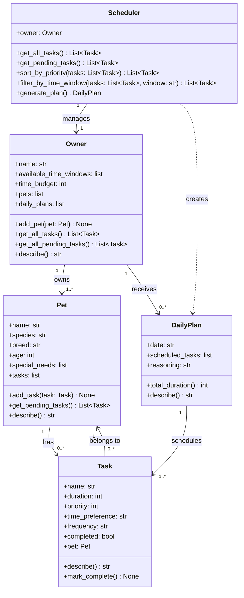

# PawPal+ Project Reflection

## 1. System Design

**a. Initial design**

- Briefly describe your initial UML design.
    - Pet
        - Variables: name, age, species, breed, special needs (medications, dietary restrictions, etc.)
        - Actions: a toString() equivalent to show its information.
    - Owner
        - Variables: name, availability time windows
        - Actions: a toString() equivalent to show its information.
    - Task
        - Variables: name, duration, priority (1, 2, 3 for low, medium, high), time preference, frequency
        - Actions: a toString() equivalent to show its information.
    - DailyPlan
        - Variables: current day, list of tasks with their times, reasoning for the arrangement of tasks.
        - Actions: a toString() equivalent to show its information.
- What classes did you include, and what responsibilities did you assign to each?
    - Refer to the previous question.

**b. Design changes**

- Did your design change during implementation?
    - Yes, I initially assumed each owner had one pet. So I implemented several changes to allow each owner to have more than one pet. The changes are described in the response to the next question.
- If yes, describe at least one change and why you made it.
    - DailyPlan was holding one list of tasks for one pet. I needed a way to reference each pet to its list of tasks. Also, each task is free-floating and does not point to a particular pet. So the solutions included each pet having its own list of tasks needed to be completed, each task has a reference to the pet it belongs to, each owner having a list of their pets and a list of daily plans that will be generated by the generate_plan() function.

---

## 2. Scheduling Logic and Tradeoffs

**a. Constraints and priorities**

- What constraints does your scheduler consider (for example: time, priority, preferences)?
- How did you decide which constraints mattered most?

**b. Tradeoffs**

- Describe one tradeoff your scheduler makes.
- Why is that tradeoff reasonable for this scenario?

---

## 3. AI Collaboration

**a. How you used AI**

- How did you use AI tools during this project (for example: design brainstorming, debugging, refactoring)?
- What kinds of prompts or questions were most helpful?

**b. Judgment and verification**

- Describe one moment where you did not accept an AI suggestion as-is.
- How did you evaluate or verify what the AI suggested?

---

## 4. Testing and Verification

**a. What you tested**

- What behaviors did you test?
- Why were these tests important?

**b. Confidence**

- How confident are you that your scheduler works correctly?
- What edge cases would you test next if you had more time?

---

## 5. Reflection

**a. What went well**

- What part of this project are you most satisfied with?

**b. What you would improve**

- If you had another iteration, what would you improve or redesign?

**c. Key takeaway**

- What is one important thing you learned about designing systems or working with AI on this project?
