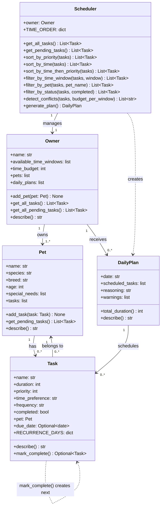

# PawPal+ Project Reflection

## 1. System Design

**a. Initial design**

- Briefly describe your initial UML design.
    - Pet
        - Variables: name, age, species, breed, special needs (medications, dietary restrictions, etc.)
        - Actions: a toString() equivalent to show its information.
    - Owner
        - Variables: name, availability time windows
        - Actions: a toString() equivalent to show its information.
    - Task
        - Variables: name, duration, priority (1, 2, 3 for low, medium, high), time preference, frequency
        - Actions: a toString() equivalent to show its information.
    - DailyPlan
        - Variables: current day, list of tasks with their times, reasoning for the arrangement of tasks.
        - Actions: a toString() equivalent to show its information.
- What classes did you include, and what responsibilities did you assign to each?
    - Refer to the previous question.

**b. Design changes**

- Did your design change during implementation?
    - Yes, I initially assumed each owner had one pet. So I implemented several changes to allow each owner to have more than one pet. The changes are described in the response to the next question.
- If yes, describe at least one change and why you made it.
    - DailyPlan was holding one list of tasks for one pet. I needed a way to reference each pet to its list of tasks. Also, each task is free-floating and does not point to a particular pet. So the solutions included each pet having its own list of tasks needed to be completed, each task has a reference to the pet it belongs to, each owner having a list of their pets and a list of daily plans that will be generated by the generate_plan() function.

---

## 2. Scheduling Logic and Tradeoffs

**a. Constraints and priorities**

- What constraints does your scheduler consider (for example: time, priority, preferences)?
    - **Time budget**: The owner has a total number of minutes available per day. The scheduler greedily fills tasks until the budget runs out.
    - **Priority**: Tasks are sorted by priority (high > medium > low) so the most urgent care activities are scheduled first.
    - **Time window preference**: Each task has a preferred window (morning, afternoon, or evening). The scheduler only considers tasks whose window matches one the owner is available for.
    - **Duration tiebreaker**: Among tasks with the same priority, shorter tasks are selected first so more tasks can fit in the budget.
- How did you decide which constraints mattered most?
    - Priority is ranked highest because a pet's health-critical tasks (medication, feeding) should never be dropped in favor of low-priority ones. Time window comes next because scheduling a morning walk in the evening defeats the purpose. Duration is the tiebreaker to maximize the number of tasks that fit, which benefits the pet's overall care.

**b. Tradeoffs**

- Describe one tradeoff your scheduler makes.
    - The conflict detection system checks for overlaps at the **time-window level** (morning, afternoon, evening) rather than tracking exact start/end times. This means it can detect that "morning is overbooked by 15 minutes" or that "Mochi has 3 tasks in the same morning window," but it cannot tell you whether two specific tasks overlap minute-by-minute. It also splits the total time budget evenly across windows rather than allowing custom per-window budgets.
- Why is that tradeoff reasonable for this scenario?
    - For a pet care app, owners think in broad windows ("I have time in the morning and evening"), not precise 15-minute calendar slots. Window-level detection catches the most common real problem (e.g. piling too many tasks into one part of the day) without adding complexity that would confuse a casual user. If exact minute-by-minute scheduling were needed (e.g. coordinating multiple caregivers), we would need to add start times to each task, but that is outside the scope of this project.

---

## 3. AI Collaboration

**a. How you used AI**

- How did you use AI tools during this project (for example: design brainstorming, debugging, refactoring)?
    - I used AI (Claude Code in the terminal) throughout every phase of this project. In Phase 1, I used it to brainstorm the class structure and decide how the Scheduler should communicate with the Owner. In Phase 2, it scaffolded the full implementations of all five classes and helped me write the demo script. In Phase 4, I asked it to suggest algorithmic improvements, then had it implement sorting, filtering, recurring tasks, and conflict detection. It also generated my entire test suite and helped me wire the backend to the Streamlit UI.
- What kinds of prompts or questions were most helpful?
    - The most effective prompts were specific and architecture-focused, like "How should the Scheduler retrieve all tasks from the Owner's pets?" and "What are the most important edge cases to test for a pet scheduler with sorting and recurring tasks?" Asking for a concrete plan before coding was more productive than asking for code directly, because it let me evaluate the approach before committing to it.

**b. Judgment and verification**

- Describe one moment where you did not accept an AI suggestion as-is.
    - When implementing the initial `generate_plan()`, the AI produced a version that sorted only by priority and returned tasks in that order. I asked for a modification: the final schedule should be re-sorted chronologically (morning -> afternoon -> evening) so it reads like an actual day, with priority only used as a tiebreaker within each window. The AI's version was functional but would have produced a plan that listed all high-priority tasks first regardless of time, which is confusing for a pet owner trying to follow a morning-to-evening routine.
- How did you evaluate or verify what the AI suggested?
    - I ran the demo script (`main.py`) after every change and visually inspected the output to confirm tasks appeared in the order I expected. I also ran `python -m pytest` after every modification to catch regressions. When the AI used Unicode arrow characters that broke on Windows (cp1252 encoding error), I caught it immediately in the terminal and had it replace them with ASCII equivalents.

---

## 4. Testing and Verification

**a. What you tested**

- What behaviors did you test?
    - 13 tests across six categories: basic operations (task completion, task count), sorting correctness (chronological order, priority within windows), recurrence logic (daily +1 day, weekly +7 days, one-off returns None), conflict detection (overbooked windows, same-pet overlaps, no false positives), budget enforcement (total duration within limit, high-priority preferred), and edge cases (pet with zero tasks).
- Why were these tests important?
    - Sorting and recurrence are the features most likely to break when the code changes; a small tweak to the lambda key function could silently reorder the entire schedule. The conflict detection tests ensure warnings appear when they should and do not appear when things are fine (no false positives). The empty-pet edge case guards against crashes when the app is used with no data, which is the very first thing a new user would encounter.

**b. Confidence**

- How confident are you that your scheduler works correctly?
    - 4 out of 5. The core logic (priority scheduling, time sorting, recurrence, and conflict warnings) is thoroughly tested. Every method has at least one test, and both happy paths and edge cases are covered.
- What edge cases would you test next if you had more time?
    - Tasks with identical names on different pets (ensuring filter_by_pet distinguishes them correctly), an owner with zero available time windows, a time budget of exactly zero, chaining multiple mark_complete() calls on the same recurring task to verify dates accumulate correctly, and stress testing with 50+ tasks to check performance.

---

## 5. Reflection

**a. What went well**

- What part of this project are you most satisfied with?
    - The Scheduler class turned out to be a clean, well-organized "brain" for the system. Each method does one thing (sort, filter, detect, generate), and they compose together naturally. The generate_plan() method reads almost like pseudocode: get pending tasks, filter by window, sort by priority, greedily fill the budget, re-sort chronologically, detect conflicts. I am also satisfied with how the recurring task logic fits into mark_complete() without requiring changes to the rest of the system.

**b. What you would improve**

- If you had another iteration, what would you improve or redesign?
    - I would add exact start/end times to tasks instead of just time-window preferences. This would enable minute-level conflict detection and allow the UI to display a proper timeline view. I would also separate the Streamlit session state logic into its own module so app.py stays focused on layout, and add a data persistence layer (JSON or SQLite) so tasks survive between browser sessions.

**c. Key takeaway**

- What is one important thing you learned about designing systems or working with AI on this project?
    - AI is an incredibly fast collaborator for scaffolding and generating code, but the human still needs to be the architect. The AI does not know your user's mental model; it will produce technically correct code that is organized in a way that makes sense to a compiler but not necessarily to a pet owner reading their daily schedule. The most valuable skill was knowing when to say "this works, but restructure it this way" rather than accepting the first output. Separating planning from coding (asking for a design review before generating code) consistently led to better results than jumping straight to implementation.
